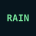

# Rain mark proposals — cycle 079

**Status: owner-approved proposal; runtime implementation not started.** These proposals address only the Atmospheric, Minimal OLED, and Terminal D29 Rain source-gap cells. They do not amend the approved D29 matrix or authorize runtime rendering changes. The existing omissions and visible Rain text remain in force until a separate implementation plan is approved and executed.

## Review target

Proposal set revision: `079-rain-marks-r1`.

Each specimen is an SVG with a 36 × 36 viewBox, matching the existing forecast mark slot. Vector scaling to 40 × 40 is intended for the current-condition hero slot. Effects Off is represented by the same static opaque artwork; no glow, blur, translucency, or animation is proposed.

| Theme | Proposed treatment | 36 dp specimen |
|---|---|---|
| Atmospheric | Pale outlined cloud and three separated cool-color falling strokes, each with a restrained dark keyline. |  |
| Minimal OLED | Open white cloud contour with three short white strokes on black; no fill, accent, gradient, or glow. |  |
| Terminal | Static monospace `RAIN` token on the opaque dark terminal canvas. |  |

Structured treatment/source details are in [`rain-marks-079.json`](rain-marks-079.json). The JSON labels all entries unapproved and records each source basis, contrast/effects behavior, fallback, and preview path.

## Source basis and limits

- **Atmospheric:** derives the contour and restrained keyline from the approved D29 Atmospheric/CLOUDY treatment. No direct Atmospheric Rain artwork is claimed.
- **Minimal OLED:** derives the sparse monochrome contour from the approved D29 Minimal OLED/CLOUDY treatment. No direct Minimal OLED Rain artwork is claimed.
- **Terminal:** follows the approved D29 Terminal condition-token grammar (CLEAR, PARTLY_CLOUDY, CLOUDY); `RAIN` itself remains a new, unapproved token proposal.

The basis for all three rows is theme language only. It does not change D29's explicit omissions for Rain, Storm, and Snow in these themes. Shared generic condition SVGs are not used as theme-specific approval evidence. The supplied condition text remains the sole required weather meaning.

## Revision identity

The retained review revision consists of the JSON plus three preview SVGs. SHA-256 values:

| Artifact | SHA-256 |
|---|---|
| [`rain-marks-079.json`](rain-marks-079.json) | `5891a0a0fb26f7707f56bd0f8af8e4655b3746925e9d54f2ce3cc1c08d93ac5c` |
| [`rain-atmospheric-079.svg`](rain-atmospheric-079.svg) | `70a11f47f9032b974e84a84c81ec1f1f639ecd85a1b418aed3a1d3237908995a` |
| [`rain-minimal-oled-079.svg`](rain-minimal-oled-079.svg) | `cf9b1aae0f1a527ae820b9a66506ebe2c5d5f48adcfd3269eee131acb80af2d9` |
| [`rain-terminal-079.svg`](rain-terminal-079.svg) | `a302451a86fa5ec16c936dc188599306f112f92fa197195f974c00dce0705c61` |

Owner disposition — **2026-09-30, approved as presented** for all three treatments in revision `079-rain-marks-r1`. The Atmospheric, Minimal OLED, and Terminal previews and the structured proposal were reviewed in sequence. The decision applies to the exact artifact hashes above. It approves these visual proposals only; it does not amend D29's matrix, approve a production change, or close TP.2E. Any runtime implementation requires its own bounded plan and verification.

## Not established by this proposal

These static design specimens are not installed-app evidence. They do not establish production mapping, contrast across actual app backdrops, fit in caller layouts, accessibility-service behavior, pixel parity, or TP.2E completion. A future implementation cycle must preserve the supplied text and semantic behavior, implement only the approved treatments, and generate fresh installed Subtle and Effects Off evidence.
